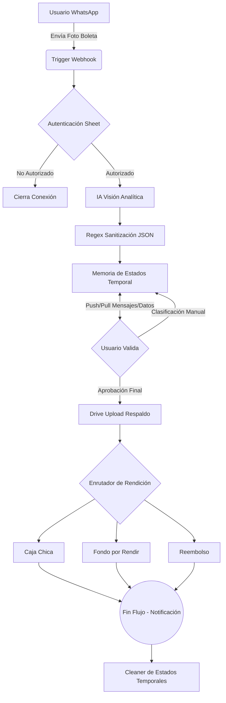

# Agente de Rendiciones | Ecosistema CRTIC

Un sistema de **Inteligencia Artificial** diseñado para optimizar, centralizar y automatizar la gestión de rendiciones de gastos corporativos, orquestado a través de n8n y accesible íntegramente vía WhatsApp. Construido bajo los estándares tecnológicos de **CRTIC**.

## 🚀 Innovación en Procesos Financieros

El sistema se integra directamente a WhatsApp, permitiendo a los usuarios enviar fotografías de recibos y documentos financieros de forma rápida y ubicua. El agente actúa como el motor principal que, mediante **visión artificial y procesamiento del lenguaje natural (NLP)**, extrae los datos relevantes de las imágenes y los estructura en la base de datos de la organización.

La arquitectura del ecosistema está concebida bajo un enfoque de **microservicios**, lo que garantiza alta escalabilidad y robustez frente a un gran volumen de transacciones. El resultado global de esta implementación es una reducción drástica en el tiempo de procesamiento de las rendiciones y una mejora significativa en la integridad de los datos financieros.

### Características Principales:
* **Autenticación Segura**: Verificación de identidades corporativas en tiempo real.
* **OCR Inteligente**: Extracción quirúrgica de data transaccional mediante Modelos Fundacionales (Google Gemini / OpenAI).
* **State Machine Conversacional**: Un manejo de estados innovador sobre WhatsApp soportado por Bases de Datos NoSQL / Sheets.
* **Detección de Anomalías**: Algoritmos de verificación orientados a blindar contra fraudes e inconsistencias humanas.
* **Enrutamiento Automático**: Sorteo y guardado definitivo de la metadata en las sub-cajas contables respectivas sumado al almacenamiento físico de respaldos en la Nube (Drive).

---

## 🏗️ Arquitectura del Sistema

El flujo, compuesto por casi 300 nodos, dibuja el siguiente ecosistema:

## 🎨 Frontend y Estética (CRTIC Style)

Este proyecto y su documentación interna adhieren de manera estricta a la **Esencia CRTIC**. 
Consulte el archivo `Documentacion-del-proyecto.html` incluido en la raíz para la presentación oficial interactiva.

* **Tipografía**: Manrope.
* **Estilizado**: Light Theme Refinado, Esquinas Afiladas (`border-radius: 0px`).
* **Energía**: Acentos vibrantes `#ff4613` (Naranja Transaccional) y `#3bd4ae` (Mint Tecnológico).

---

## 📁 Guía de Archivos para No Programadores

Si no estás acostumbrado a trabajar con GitHub o repositorios de código, aquí tienes una explicación sencilla de los archivos que ves en esta carpeta y para qué sirven:

* **`Agente rendiciones.json`**: ¡El corazón del proyecto! Es el archivo que contiene los ~300 nodos, la lógica y las conexiones de tu agente. Lo puedes importar directamente a n8n para que funcione.
* **`DOCUMENTACION_AGENTE.md`**: Un archivo de texto que explica paso por paso, en español, cómo funciona la lógica interna del agente.
* **`Documentacion-del-proyecto.html`**: Una página web completa y diseñada con la marca CRTIC que resume todo el proyecto de forma visual. ¡Haz doble clic en ella para verla en tu navegador (Chrome, Edge, Safari)!
* **`README.md`**: El archivo que estás leyendo ahora mismo. Es la portada o "carta de presentación" del proyecto para cualquier persona que entre a la carpeta.
* **`LICENSE`**: Un documento legal que dice bajo qué reglas otras personas pueden usar o copiar tu proyecto (en este caso, la Licencia libre MIT).
* **`CONTRIBUTING.md`**: Una guía rápida que explica a otros programadores u organizaciones cómo pueden participar, ayudar y mejorar este agente.
* **`.gitignore`**: Un archivo técnico oculto. Le dice a GitHub qué archivos "basura" o privados *NO* debe subir a internet (como contraseñas o archivos temporales de tu computador).
* **`.github/` (Carpeta oculta)**: Contiene automatizaciones para cuando subas esto a internet. Por ejemplo, tiene una plantilla (`bug_report.md`) para que si alguien encuentra un error, lo reporte de forma ordenada, y un robot (`ci.yml`) que verifica que tu código no esté roto.

---
> *El Futuro sí existe.* - Centro para la Revolución Tecnológica en Industrias Creativas.
