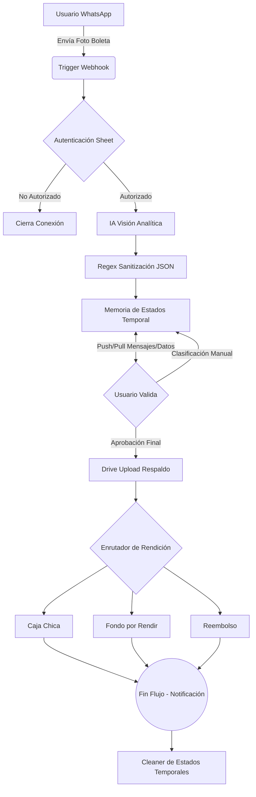
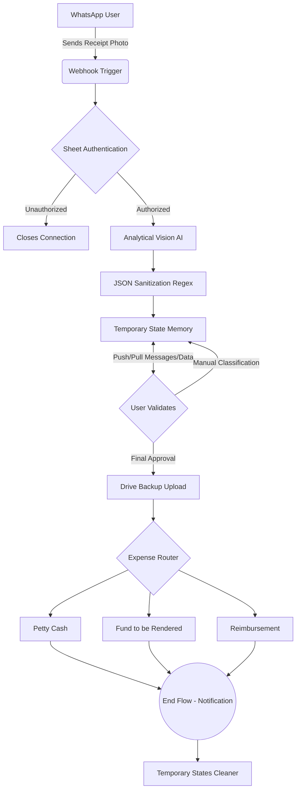

  

# Agente de Rendiciones | Expense Management Agent

* [Español 🇪🇸](#español)
* [English 🇬🇧](#english)

---

## Español

Un sistema de **Inteligencia Artificial** diseñado para optimizar, centralizar y automatizar la gestión de rendiciones de gastos corporativos, orquestado a través de n8n y accesible íntegramente vía WhatsApp. Construido bajo los estándares tecnológicos de **CRTIC**.

### 🚀 Innovación en Procesos Financieros

El sistema se integra directamente a WhatsApp, permitiendo a los usuarios enviar fotografías de recibos y documentos financieros de forma rápida y ubicua. El agente actúa como el motor principal que, mediante **visión artificial y procesamiento del lenguaje natural (NLP)**, extrae los datos relevantes de las imágenes y los estructura en la base de datos de la organización.

La arquitectura del ecosistema está concebida bajo un enfoque de **microservicios**, lo que garantiza alta escalabilidad y robustez frente a un gran volumen de transacciones. El resultado global de esta implementación es una reducción drástica en el tiempo de procesamiento de las rendiciones y una mejora significativa en la integridad de los datos financieros.

#### Características Principales:
* **Autenticación Segura**: Verificación de identidades corporativas en tiempo real.
* **OCR Inteligente**: Extracción quirúrgica de data transaccional mediante Modelos Fundacionales (Google Gemini / OpenAI).
* **State Machine Conversacional**: Un manejo de estados innovador sobre WhatsApp soportado por Bases de Datos NoSQL / Sheets.
* **Detección de Anomalías**: Algoritmos de verificación orientados a blindar contra fraudes e inconsistencias humanas.
* **Enrutamiento Automático**: Sorteo y guardado definitivo de la metadata en las sub-cajas contables respectivas sumado al almacenamiento físico de respaldos en la Nube (Drive).

### 🏗️ Arquitectura del Sistema

El flujo, compuesto por casi 300 nodos, dibuja el siguiente ecosistema:

*Para visualizar o editar este diagrama de arquitectura interactivamente, puedes utilizar el [Mermaid Live Editor](https://mermaid.ai/web/).*

### 🎨 Frontend y Estética (CRTIC Style)

Este proyecto y su documentación interna adhieren de manera estricta a la **Esencia CRTIC**. 
Consulte el archivo `Documentacion-del-proyecto.html` incluido en la raíz para la presentación oficial interactiva.

* **Tipografía**: Manrope.
* **Estilizado**: Light Theme Refinado, Esquinas Afiladas (`border-radius: 0px`).
* **Energía**: Acentos vibrantes `#ff4613` (Naranja Transaccional) y `#3bd4ae` (Mint Tecnológico).

### 📁 Guía de Archivos para No Programadores

Si no estás acostumbrado a trabajar con GitHub o repositorios de código, aquí tienes una explicación sencilla de los archivos que ves en esta carpeta y para qué sirven:

* **`Agente rendiciones.json`**: ¡El corazón del proyecto! Es el archivo que contiene los ~300 nodos, la lógica y las conexiones de tu agente. Lo puedes importar directamente a n8n para que funcione.
* **`DOCUMENTACION_AGENTE.md`**: Un archivo de texto que explica paso por paso, en español, cómo funciona la lógica interna del agente.
* **`Documentacion-del-proyecto.html`**: Una página web completa y diseñada con la marca CRTIC que resume todo el proyecto de forma visual. ¡Haz doble clic en ella para verla en tu navegador (Chrome, Edge, Safari)!
* **`README.md`**: El archivo que estás leyendo ahora mismo. Es la portada o "carta de presentación" del proyecto para cualquier persona que entre a la carpeta.
* **`LICENSE`**: Un documento legal que dice bajo qué reglas otras personas pueden usar o copiar tu proyecto (en este caso, la Licencia libre MIT).
* **`CONTRIBUTING.md`**: Una guía rápida que explica a otros programadores u organizaciones cómo pueden participar, ayudar y mejorar este agente.
* **`.gitignore`**: Un archivo técnico oculto. Le dice a GitHub qué archivos "basura" o privados *NO* debe subir a internet (como contraseñas o archivos temporales de tu computador).

---
> *El Futuro sí existe.* - Centro para la Revolución Tecnológica en Industrias Creativas.

---

## English

An **Artificial Intelligence** system designed to optimize, centralize, and automate the management of corporate expense reports, orchestrated through n8n and fully accessible via WhatsApp. Built under the technological standards of **CRTIC**.

### 🚀 Innovation in Financial Processes

The system integrates directly with WhatsApp, allowing users to quickly and ubiquitously send photographs of receipts and financial documents. The agent acts as the core engine which, through **computer vision and natural language processing (NLP)**, extracts relevant data from the images and structures them into the organization's database.

The ecosystem's architecture is built on a **microservices** approach, ensuring high scalability and robustness against a large volume of transactions. The overall result of this implementation is a drastic reduction in the processing time of expense reports and a significant improvement in the integrity of financial data.

#### Key Features:
* **Secure Authentication**: Real-time verification of corporate identities.
* **Smart OCR**: Surgical extraction of transactional data using Foundational Models (Google Gemini / OpenAI).
* **Conversational State Machine**: An innovative state management system over WhatsApp supported by NoSQL / Sheets databases.
* **Anomaly Detection**: Verification algorithms aimed at shielding against human errors and potential fraud.
* **Automated Routing**: Sorting and definitive saving of metadata into respective accounting sub-boxes, along with the physical storage of backups in the Cloud (Drive).

### 🏗️ System Architecture

The workflow, consisting of nearly 300 nodes, outlines the following ecosystem:

*To interactively view or edit this architecture diagram, you can use the [Mermaid Live Editor](https://mermaid.ai/web/).*

### 🎨 Frontend & Aesthetics (CRTIC Style)

This project and its internal documentation strictly adhere to the **CRTIC Essence**.
Please refer to the `Documentacion-del-proyecto.html` file included in the root directory for the official interactive presentation.

* **Typography**: Manrope.
* **Styling**: Refined Light Theme, Sharp Corners (`border-radius: 0px`).
* **Energy**: Vibrant accents `#ff4613` (Transactional Orange) and `#3bd4ae` (Technological Mint).

### 📁 File Guide for Non-Programmers

If you are not used to working with GitHub or code repositories, here is a simple explanation of the files you see in this folder and what they are used for:

* **`Agente rendiciones.json`**: The heart of the project! It's the file containing the ~300 nodes, logic, and connections of your agent. You can import it directly into n8n to make it work.
* **`DOCUMENTACION_AGENTE.md`**: A text file explaining step-by-step how the agent's internal logic works.
* **`Documentacion-del-proyecto.html`**: A complete, CRTIC-branded web page that visually summarizes the entire project. Double-click it to view it in your browser (Chrome, Edge, Safari)!
* **`README.md`**: The file you are currently reading. It is the portfolio or "cover letter" of the project for anyone entering the folder.
* **`LICENSE`**: A legal document stating the rules under which other people can use or copy your project (in this case, the free MIT License).
* **`CONTRIBUTING.md`**: A quick guide explaining to other programmers or organizations how they can participate, help, and improve this agent.
* **`.gitignore`**: A hidden technical file. It tells GitHub which "junk" or private files it should *NOT* upload to the internet (like passwords or temporary files from your computer).

---
> *The Future Does Exist.* - Center for the Technological Revolution in Creative Industries.
